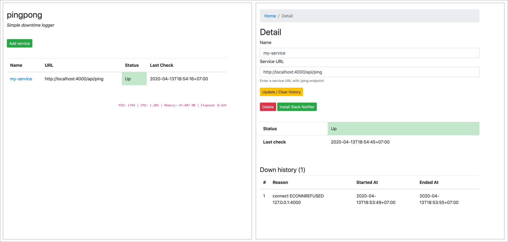

# pingpong

A simple downtime logger for your microservices



## Features

 - Log multiple services
 - Using no database
 - Using `setInterval`
 - Slack notifier
 - Simplicity at its best 👌

## Installation

Download the latest from [releases](https://github.com/mgilangjanuar/pingpong/releases), extract, and run `node index.js`

Or, build by yourself:

0. Clone repository

```
git clone https://github.com/mgilangjanuar/pingpong.git
```

1. Install dependencies

```
npm install
```

2. Build

```
npm run build.prod
```

3. Run!

```
node dist/index.js
```

Note: please use process manager like PM2 or Forever

## Environment variables

This app read `.env` file as environment variable

Env Name | Default
--- | ---
PORT | 4001
WORKER_INTERVAL | 1000

## License

MIT

