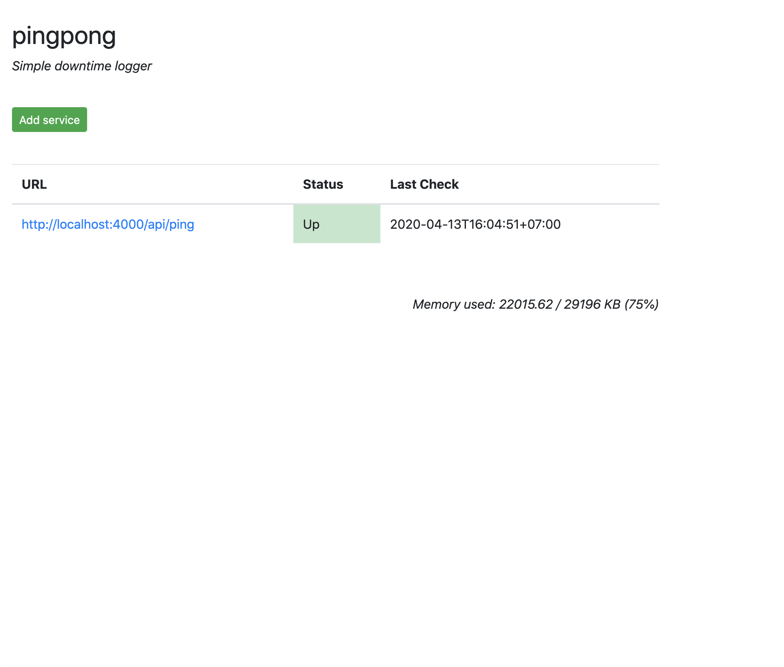
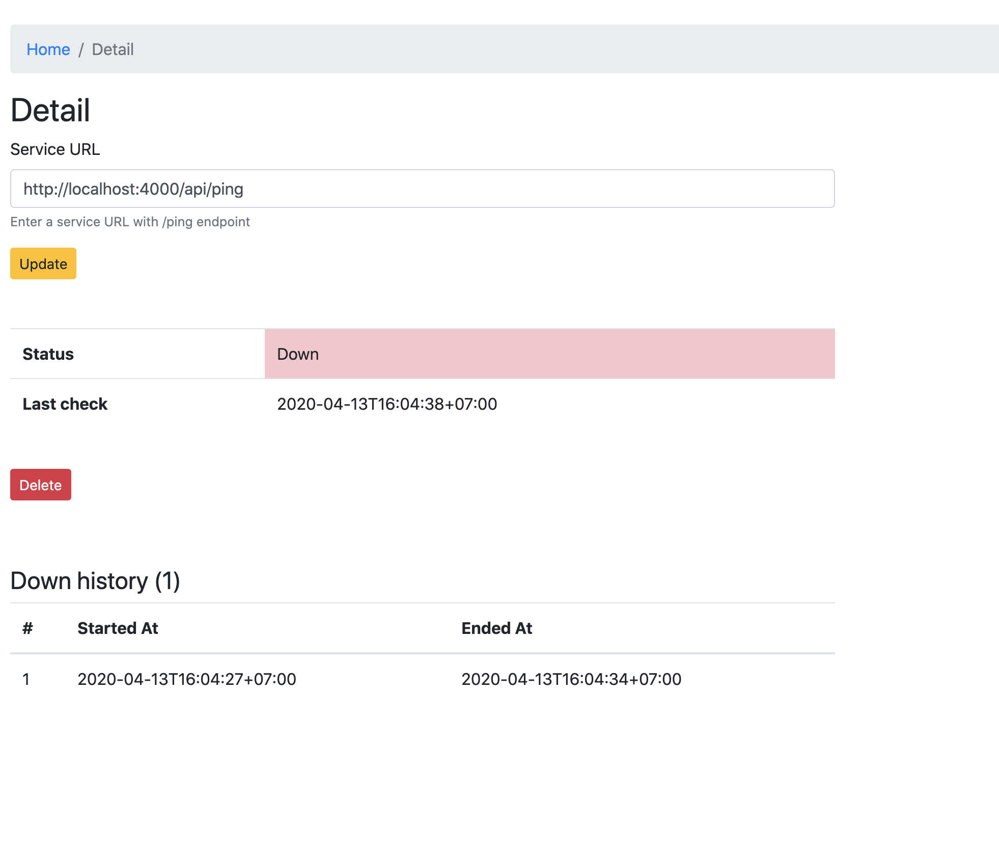

# pingpong

A simple uptime logger for your microservices

 

## Installation

0. Clone repository

```
git clone https://github.com/mgilangjanuar/pingpong.git
```

1. Install dependencies

```
npm install
```

2. Run!

```
node dist/index.js
```

Note: please use process manager like PM2 or Forever